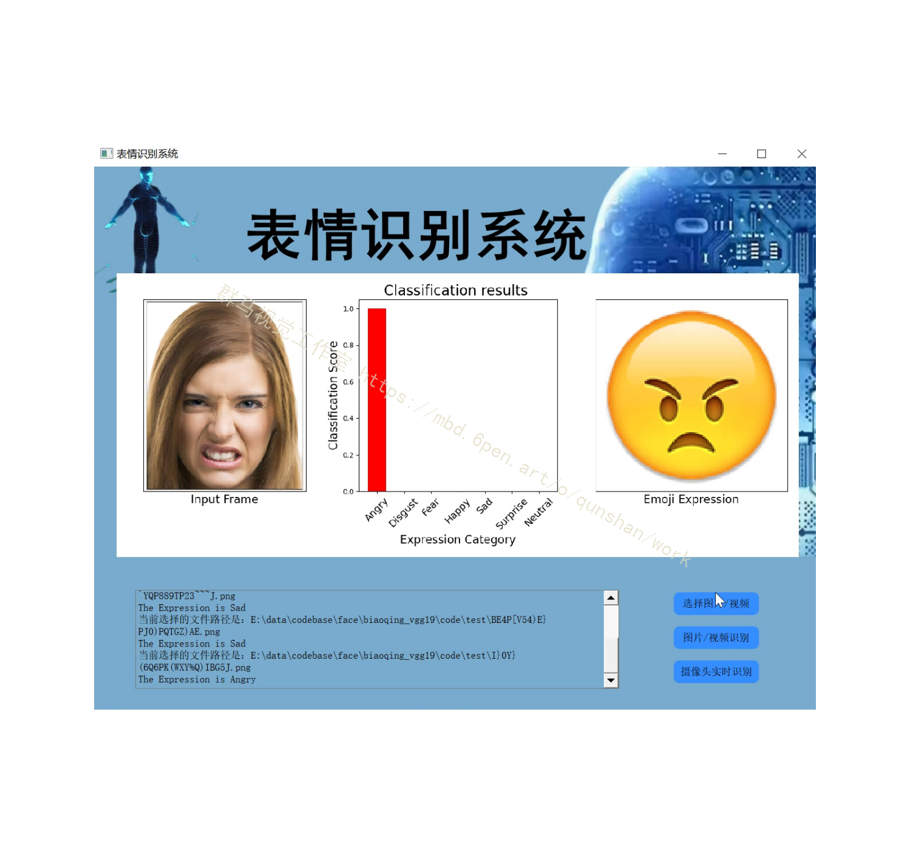
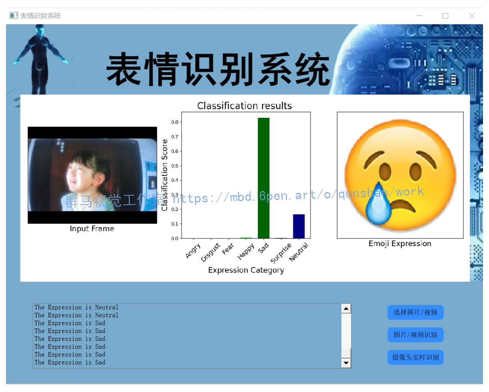
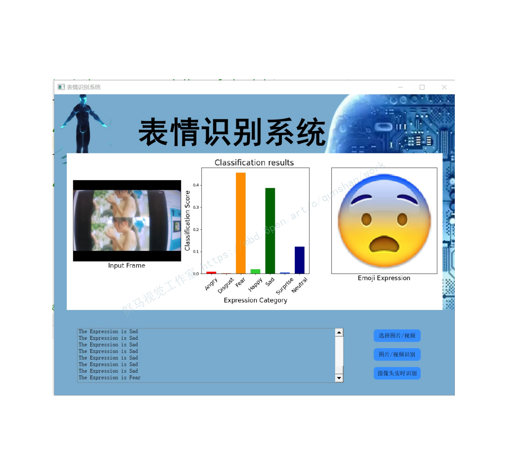
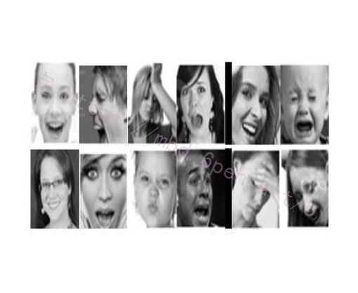
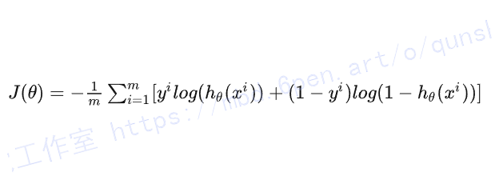
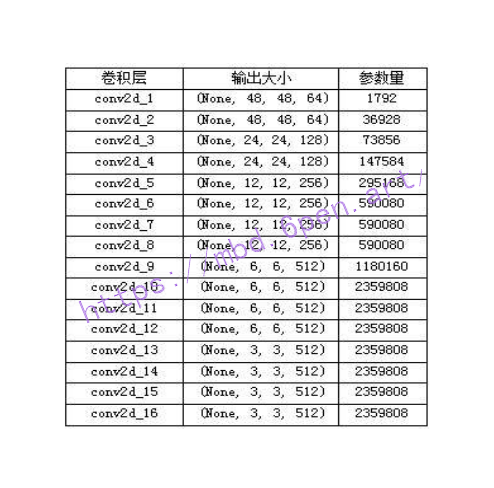
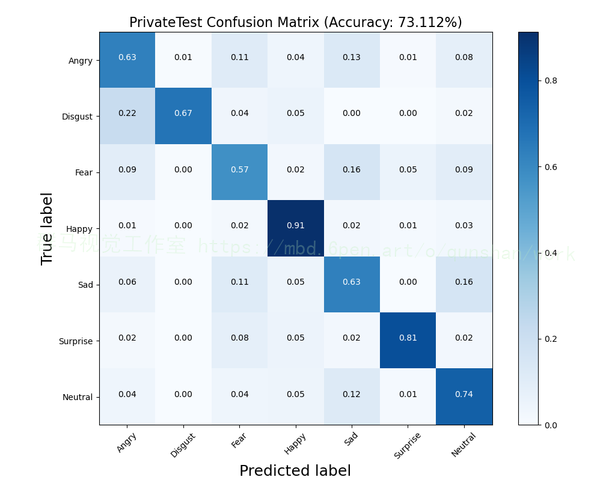
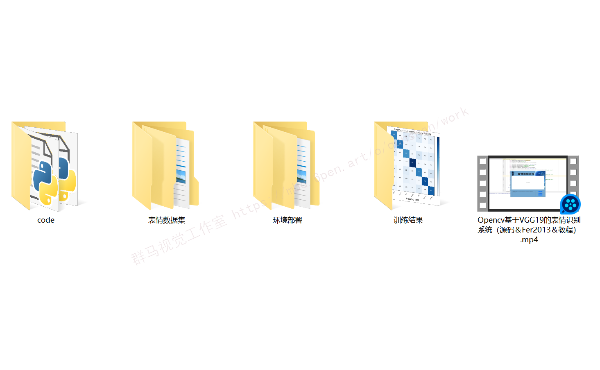

# 1.研究背景

在深度学习中,传统的卷积神经网络对面部表情特征的提取不充分以及计算参数量较大的问题,导致分类准确率偏低。因此,提出了一种基于改进的VGG19网络的人脸表情识别算法。首先,对数据进行增强如裁剪、翻转等处理,然后采用平均池化取代全连接操作从而大幅降低网络的参数量,最后,测试的时候采用了10折交叉验证的方法增加数据量以提升模型的泛化能力。实验结果表明,改进后的神经网络在FER2013测试数据集上的识别准确率为73.112%。

# 2.图片演示


# 3.实时摄像头演示





# 4.视频效果演示
[Opencv基于VGG19的表情识别系统（源码＆Fer2013＆教程）_哔哩哔哩_bilibili](https://www.bilibili.com/video/BV1MD4y1173A/?vd_source=bc9aec86d164b67a7004b996143742dc)

# 5.数据集的准备
#### FER2013数据集
FER2013数据集由Pierre Luc carrier和Aaron Courville通过搜索相关的情感关键词在网络上爬取的。这些图像都是经过人工标注的。它是由35886张表情图片构成，测试集28708张，公有验证集和私有验证集各3589张，每张图片是由大小为48×48像素的灰度图组成，分为7个类别，分别为中性、快乐、惊讶、悲伤、愤怒、厌恶、恐惧。图1展示了数据集中的几个样本。


# 6.VGG19表情分类网络的构建
#### 现有网络存在的问题
近几年来，前馈神经网络（FNN）和卷积神经网络（CNN）也被用来提取表情特征。基于卷积神经网络（CNN）的新的识别框架在FER中已经取得了显著的结果。CNN中的多个卷积和汇集层可以提取整个面部或局部区域的更高和多层次的特征，且具有良好的面部表情图像特征的分类性能。经验证明，CNN比其它类型的神经网络在图像识别方面更为优秀。基于神经网络的方法也存在着两个问题：

（1）简单的神经网络（如FNN）忽略图像二维信息。

（2）浅层卷积网络所提取的特征，鲁棒性较差。

基本上面的人为设计特征与神经网络的缺陷，我们尝试着用深度卷积网络来解决表情识别的问题。

#### 模型的设计
（1）我们采用深度卷积神经网络来将人脸表情特征提取与表情分类融合到一个end-to-end的网络中。分别采用了VGG19和Resnet18来完成表情的识别与分类。

（2）VGG19 的每一个小块是有一个卷积层，一个BatchNorm层，一个relu层和一个平均池化层来构成的。而resnet是由两个卷积层，两个BatchNorm层组成，而且每个resnet模块输入输出端还有快捷链接。

（3）在全连接层之前加入了dropout策略，增加了模型鲁棒性；

（4）我们都去掉了传统VGG19与Resnet18中的多个全连接层，直接在一个全连接层后直接分为7类去识别。

#### 损失函数的设计
[受到该博客的启发，我们探索了两种损失函数的计算方法](https://afdian.net/item?plan_id=1e0bd0065c1411ed806652540025c377)，第一种是交叉熵损失函数。模型在全连接层之后，得到了每一类的输出概率，但此时概率是没有经过归一化的，我们通过一个softmax层，将概率归一化到1，更加易于数据处理。而交叉熵损失函数计算公式如下：


#### 网络模型的改进
首先,[参考该博客利用超深度卷积神经网络提取人脸表情特征](https://mbd.pub/o/bread/Y5iTmp1r)。然后,通过卷积核大小是1×1的平均池化层对提取的特征进行降维。最后,采用带有动量的随机梯度方法对算法进行优化,通过softmax 函数来进行分类。
在训练过程中,改进后的网络结构的参数量如表1所示。表格只统计了网络结构中所有的卷积层,不包含其他网络层。相比原始VGG网络中140MB大小的参数量,减少了50MB左右,大大节省了计算资源和训练时间。


# 7.实验结果的分析
我们做了一系列的实验,它们都遵循这样一个过程:数据预处理(包括数据增强)-搭建神经网络-训练-测试-评估模型。其中一组实验单独使用CNN(VGG19)对FER2013进行了实验。经过约10小时250轮的训练获得训练模型并在测试集上进行测试。准确率为73.112%。我们在下图中分别记录了训练、验证,测试时的混淆矩阵。


# 8.代码实现
```
import torch.nn as nn
from torch.utils import data
from torchvision import transforms
from PIL import Image
from torchvision import models as MD
import torch
import torchvision.datasets as datasets
 
 
def  Make_data(path):
    img=datasets.ImageFolder(path,
                         tensform=transforms.Compose([transforms.Scale([48, 48]), transforms.ToTensor()]))
    imgs_load=data.DataLoader(img,batch_size=100,shuffle=True)
    return imgs_load
 
 
def train(dada_loader):
    model = MD.vgg19(pretrained=False)
    model.load_state_dict(torch.load("../models/???.pth"))
    num_input = model.classifier[6].in_features
    feature_model = list(model.classifier.children())
    feature_model.pop()
    feature_model.append(nn.Linear(num_input, 7))
    model.classifier = nn.Sequential(*feature_model)
    model = model.cuda()
    critersion = nn.CrossEntropyLoss()
    opt = torch.optim.SGD(model.parameters(), lr=0.001)
 
    for ench in range(200):
        sum = 0
        for i, data in enumerate(dada_loader):
            img, targe = data[1]
            targe = targe.cuda()
            img = img.cuda()
            output = model(img)
            loss = critersion(output, targe)
            opt.zero_grad()
            loss.backward()
            opt.step()
            sum += loss
        print(sum)
        if ench % 20 == 0:
            torch.save(model.state_dict(), "../models/" + str(ench) + ".pkl")
 
 
def test(dada_loader):
    model = MD.vgg19(pretrained=False)
    num_input = model.classifier[6].in_features
    feature_model = list(model.classifier.children())
    feature_model.pop()
    feature_model.append(nn.Linear(num_input, 7))
    model.classifier = nn.Sequential(*feature_model)
    # 加载训练过的模型进行测试
    model.load_state_dict(torch.load(""))
    model = model.cuda()
    for i, data in enumerate(dada_loader):
        img, targe = data[1]
        targe = targe.cuda()
        img = img.cuda()
        output = model(img)
        _, pred = torch.max(output.data, 1)
        print(torch.sum(pred == targe))
 
 
if __name__ == '__main__':
    trainpath="../train"
    trainimg=Make_data(trainpath)
    train(trainimg)
 
 
    testpath = "../test"
    testimg = Make_data(trainpath)
    test(testimg)
```

# 9.系统整合
下图[源码＆环境部署视频教程＆表情数据集＆自定义UI界面＆训练](https://s.xiaocichang.com/s/937dfe)


参考博客[《Opencv基于改进VGG19的表情识别系统（源码＆Fer2013＆教程）》](https://mbd.pub/o/qunma/work)


# 10.参考文献

[1]王伟东,罗莹,王坤,等.基于核相关滤波的改进目标跟踪算法[J].数字技术与应用.2021,(7).DOI:10.19695/j.cnki.cn12-1369.2021.07.29.
[2]樊轲.基于迁移学习的癫痫发作预测方法[J].电子设计工程.2022,30(12).DOI:10.14022/j.issn1674-6236.2022.12.006.
[3]王彦博,王浩然,张剑书,等.基于计算机视觉的疼痛检测系统的设计与实现[J].电子元器件与信息技术.2021,(6).DOI:10.19772/j.cnki.2096-4455.2021.6.085.
[4]孙帅成,徐春融,刘瑞明.专注度识别应用研究[J].科技资讯.2021,(14).DOI:10.16661/j.cnki.1672-3791.2105-5042-3389.
[5]龙英潮,丁美荣,林桂锦,等.基于视听觉感知系统的多模态情感识别[J].计算机系统应用.2021,30(12).DOI:10.15888/j.cnki.csa.008235.
[6]牛犇.基于深度残差神经网络与迁移学习的微体化石小样本图像识别研究[D].2021
[7]邓爽,何小海,卿粼波,等.基于改进VGG网络的弱监督细粒度阿尔兹海默症分类方法[J].计算机应用.2022,42(1).DOI:10.11772/j.issn.1001-9081.2021020258.
[8]赵卓.手机端人脸表情迁移和虚拟角色面部表情生成研究与应用[D].2021
[9]何其霖,穆平安.VGG网络与多特征融合的遮挡人脸检测[J].电子测量技术.2021,44(18).DOI:10.19651/j.cnki.emt.2107045.
[10]刘文豪.基于图像处理与深度学习的车载式隧道衬砌裂缝检测系统及方法研究[D].2021
[11]孙观.基于风格迁移算法的拍摄美化类手机应用设计研究[D].2021
[12]赵雅.基于时空特征的动态手势识别方法研究[D].2021

---
#### 如果您需要更详细的【源码和环境部署教程】，除了通过【系统整合】小节的链接获取之外，还可以通过邮箱以下途径获取:
#### 1.请先在GitHub上为该项目点赞（Star），编辑一封邮件，附上点赞的截图、项目的中文描述概述（About）以及您的用途需求，发送到我们的邮箱
#### sharecode@yeah.net
#### 2.我们收到邮件后会定期根据邮件的接收顺序将【完整源码和环境部署教程】发送到您的邮箱。
#### 【免责声明】本文来源于用户投稿，如果侵犯任何第三方的合法权益，可通过邮箱联系删除。